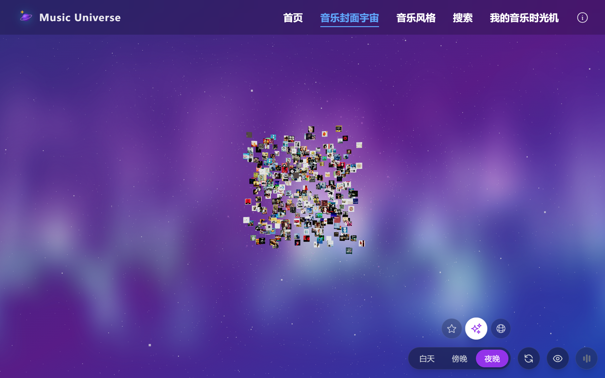

# 🎵 Music Universe | 音乐宇宙

> An immersive 3D music collection visualization project. Explore melodies in a galaxy of memories.
> 
> 一个沉浸式的 3D 音乐收藏可视化项目。在星河中漫游，发现旋律与记忆的共鸣。



## 🌟 Introduction | 项目简介

**Music Universe** is a personal project that transforms a spreadsheet of music collection data into an interactive 3D web experience. It allows users to explore music tracks as stars in a galaxy, visualize listening habits through word clouds, and rediscover albums through a "music randomizer" interface.

**Music Universe** 是一个将个人音乐收藏数据转化为交互式 3D 网页体验的项目。它让用户像探索星系一样浏览音乐曲目，通过词云可视化听歌习惯，并通过“音乐随机选”重新发现那些珍藏的专辑。

### 🎨 Origin & Credits | 原创声明

This project is a 3-month personal exploration journey, designed and developed by **MagicCoAI** (Author of WeChat Official Account "D小调片段记录") in collaboration with AI technology.

*   **Primary AI Assistant:** TraeAI
*   **Code & Logic Support:** DeepSeek, ChatGPT, Gemini

**✨ Inspiration | 灵感致谢**

The visual concept of exploring archives in a 3D space is inspired by [Studio Olafur Eliasson: Your uncertain archive](https://olafureliasson.net/uncertain). This project interprets that concept through a personalized music universe, built with a distinct technical stack and design language.

本项目的“3D 档案漫游”交互形式受到 Olafur Eliasson 工作室网站 *Your uncertain archive* 的启发。在此基础上，我结合个人音乐数据，使用完全独立的技术栈与视觉设计语言进行了重新演绎。

While the code is open source, the design philosophy and the curated music data structure represent a significant personal investment.

本项目历时3个月，由 **MagicCoAI**（公众号「D小调片段记录」作者）与 AI 协同完成。
核心编程工具为 **TraeAI**，并在 **DeepSeek**, **ChatGPT**, **Gemini** 的协助下完成了各个复杂场景的建设。虽然代码开源，但项目的设计理念与数据结构凝聚了作者大量心血，请尊重原创。

🔗 **Live Demo:** [https://magiccoai.github.io/my-music-universe/](https://magiccoai.github.io/my-music-universe/)

## ✨ Key Features | 核心亮点

*   **🌌 3D Star Map (3D 星图)**
    *   *Visualizing music tracks as interactive celestial bodies in a 3D space.*
    *   基于 React Three Fiber 构建的三维星图，将音乐曲目转化为可交互的星体，在虚拟空间中重构音乐检索体验。

*   **🎨 Atmospheric Themes (氛围栖息地)**
    *   *Immersive time-based themes featuring diverse habitat scenes—creating a resonant listening environment.*
    *   沉浸式氛围主题。包含**白昼、傍晚、深夜**三个时间维度，并构建了**云端飞梦、落日余晖、极光星空、雪山**等“栖息地”场景，为音乐聆听营造独特的视听场域。

*   **☁️ Word Cloud Galaxy (词云星系)**
    *   *Dynamic visualization of musical preferences, mapping artist and genre distributions.*
    *   动态可视化的听歌偏好分布，将艺术家与流派风格以星云形态直观呈现，一目了然地回顾音乐品味。

*   **💫 Special Collection (特别收藏)**
    *   *A curated carousel archiving significant albums and their accompanying narratives.*
    *   以 3D 旋转木马形式存档具有特殊意义的专辑及其背后的记忆故事，打造个人情感的时间胶囊。

*   **🎰 Music Randomizer (音乐随机选)**
    *   *A serendipitous selector for music discovery, breaking decision paralysis.*
    *   打破选择困难的随机播放机制，模拟老虎机交互，为重温旧专辑创造“不期而遇”的惊喜感。

*   **📱 Responsive Design (多端适配)**
    *   *Fully responsive architecture optimized for both desktop exploration and mobile interaction.*
    *   全端响应式设计。针对桌面端与移动端差异化优化交互体验，并集成了设备方向自适应引导。


## 🛠️ Tech Stack | 技术栈

*   **Core Framework:** React 18, React Router 6
*   **3D Graphics & Animation:**
    *   **Engine:** Three.js
    *   **React Abstraction:** React Three Fiber (`@react-three/fiber`), `@react-three/drei`
    *   **Animation:** Framer Motion, React Spring (`@react-spring/three`)
*   **Data Visualization:**
    *   **Charts & Word Clouds:** ECharts, `echarts-wordcloud`
    *   **DOM Manipulation:** D3.js
*   **Styling:**
    *   **Utility-First CSS:** Tailwind CSS
    *   **Component-Scoped CSS:** Styled-jsx
*   **State Management & Logic:**
    *   **React Hooks:** For component-level state and logic.
    *   **React Context:** For global state (e.g., theme, music data).
*   **Build & Development:**
    *   **Toolkit:** Create React App (customized with Craco)
    *   **Testing:** React Testing Library, Jest
*   **Deployment & CI/CD:**
    *   **Platform:** GitHub Pages
    *   **Automation:** GitHub Actions
*   **Utilities:**
    *   **HTTP Client:** Axios
    *   **Virtualization:** `@tanstack/react-virtual`, `react-window` (For rendering large lists efficiently)
    *   **Image Optimization:** Sharp (Used in build scripts)

## 🌳 Project Architecture | 项目架构

The project follows a standard React application structure, organized for clarity and scalability.

```
my-music-universe/
├── public/
│   ├── data/         # 音乐数据 (Music data, JSON)
│   ├── audio/        # 音频预览 (Audio previews)
│   ├── images/       # 专辑封面与UI图片 (Album art and UI images)
│   └── index.html    # HTML 入口文件 (Main HTML entry point)
│
└── src/
    ├── assets/       # 静态资源，如图标 (Static assets like icons)
    ├── components/   # 可复用的UI组件 (3D & 2D Reusable UI components)
    ├── hooks/        # 封装共享逻辑的自定义钩子 (Custom React hooks)
    ├── pages/        # 应用的主要页面 (Top-level page components)
    ├── utils/        # 通用工具函数 (Utility functions)
    ├── workers/      # 后台任务处理 (Web workers for background tasks)
    ├── App.js        # 根组件与路由配置 (Root component with routing)
    ├── MusicUniverse.jsx # 核心3D场景调度器 (Core 3D scene orchestrator)
    ├── UniverseContext.jsx # 全局状态管理 (Global state management)
    └── index.js      # 应用入口文件 (Application entry point)
```

*   **`src/`**: The main source code directory.
    *   **`components/`**: Contains all reusable React components, from simple UI elements to complex 3D scene components.
    *   **`pages/`**: Each file corresponds to a major view of the application (e.g., `HomePage`, `ArchivePage`).
    *   **`hooks/`**: Custom React hooks for managing shared logic, such as `useMusicData` for data fetching or `useIsMobile` for responsive checks.
    *   **`utils/`**: Utility functions for common tasks like data transformation (`dataTransformUtils.js`) and image handling (`imageUtils.js`).
    *   **`workers/`**: Background scripts for performance-intensive tasks. For example, `wordcloud-layout.worker.js` computes the word cloud layout without blocking the main thread.
    *   **`assets/`**: Static assets like icons and images.
    *   **`App.js`**: The root component that sets up routing and global context.
    *   **`MusicUniverse.jsx`**: A key component that orchestrates the main 3D music visualization experience.
    *   **`UniverseContext.jsx`**: A React Context to provide global state (like theme and music data) throughout the component tree.

*   **`public/`**: Contains static files, including the core `index.html`, music data (`data/`), and media assets (`audio/`, `images/`). This separation ensures that large data files are not bundled with the JavaScript code.

This architecture separates concerns effectively, making the codebase easier to navigate, maintain, and extend.

## 📱 Responsive Design & Accessibility | 响应式设计与无障碍访问

User experience is at the heart of Music Universe. While the 3D scenes are best enjoyed on a desktop, significant effort was invested to ensure a seamless and intuitive experience on mobile devices, alongside a strong commitment to web accessibility.

用户体验是“音乐宇宙”项目的核心。尽管 3D 场景在桌面端能获得最佳效果，我们仍投入了大量精力来确保移动设备也能拥有流畅、直观的体验，并坚定地致力于提升网站的无障碍访问性。

### Mobile-First Approach & Optimization | 移动端优先与优化

*   **Responsive Layouts:** The application uses a combination of Tailwind CSS's responsive utilities and custom hooks like `useIsMobile` to adapt layouts, font sizes, and component behaviors for smaller screens.
    *   **响应式布局:** 项目结合了 Tailwind CSS 的响应式工具类和自定义钩子（如 `useIsMobile`），以适配不同尺寸屏幕下的布局、字体和组件行为。
*   **Performance Tuning:** Mobile performance was a key focus. We iteratively tested pages using Lighthouse, optimizing asset loading, reducing bundle size, and leveraging techniques like code splitting and lazy loading to ensure fast initial load times on mobile networks.
    *   **性能调优:** 移动端性能是优化的重点。我们使用 Lighthouse 对页面进行迭代测试，通过优化资源加载、缩减构建包体积、代码分割和懒加载等技术，确保在移动网络下也能实现快速的首次加载。
*   **Touch-Friendly Interactions:** All interactive elements, including the 3D scene navigation and music player, are designed to be easily controllable via touch.
    *   **触控友好交互:** 所有交互元素，包括 3D 场景导航和音乐播放器，都为触控操作进行了优化设计。
*   **Orientation Hint:** For the best 3D experience on mobile, a dedicated `OrientationHint` component was created to gently guide users to landscape mode, which is better suited for immersive exploration.
    *   **横屏提示:** 为了在移动端获得最佳的 3D 体验，我们创建了一个专门的 `OrientationHint` 组件，友好地引导用户切换到更适合沉浸式探索的横屏模式。

### Accessibility (a11y) Commitment | 对无障碍访问的承诺

This project was an enlightening journey into the importance of accessibility. Guided by AI-powered coding tools that highlighted best practices, we integrated ARIA (Accessible Rich Internet Applications) attributes and semantic HTML to make the site usable for everyone, including those who rely on screen readers.

这个项目也是一次关于“无障碍访问”重要性的启发之旅。在 AI 编程工具对最佳实践的指导下，我们集成了 ARIA (Accessible Rich Internet Applications) 属性和语义化 HTML，以确保网站对包括屏幕阅读器用户在内的所有人都是可用的。

*   **Semantic HTML:** Using tags like `<main>`, `<nav>`, and `<button>` correctly provides a meaningful structure for assistive technologies.
    *   **语义化 HTML:** 正确使用 `<main>`, `<nav>`, `<button>` 等标签，为辅助技术提供了有意义的页面结构。
*   **ARIA Attributes:** We've implemented `aria-label`, `aria-hidden`, and other ARIA roles and properties to provide context to interactive elements, such as labeling buttons and controls within the music player and 3D navigation.
    *   **ARIA 属性:** 我们广泛应用了 `aria-label`, `aria-hidden` 等 ARIA 角色和属性，为交互元素（如音乐播放器和 3D 导航中的按钮）提供上下文，增强了可访问性。
*   **Focus Management:** Careful attention was paid to keyboard navigation, ensuring all interactive elements are focusable and that the focus order is logical.
    *   **焦点管理:** 我们同样关注键盘导航，确保所有交互元素都是可聚焦的，并且焦点顺序符合逻辑。

This focus on user experience, from mobile optimization to accessibility, reflects a core philosophy: technology should be inclusive and built for humans first.

这种从移动端优化到无障碍访问对用户体验的关注，反映了项目的核心理念：技术应具备包容性，并以人为本。

## 🚀 Getting Started | 快速开始

### Prerequisites | 前置要求
*   Node.js (v16+)
*   npm or yarn

### Installation | 安装

1.  **Clone the repository | 克隆仓库**
    ```bash
    git clone https://github.com/magiccoai/my-music-universe.git
    cd my-music-universe
    ```

2.  **Install dependencies | 安装依赖**
    ```bash
    npm install
    # or
    yarn install
    ```

3.  **Start development server | 启动开发服务器**
    ```bash
    npm start
    ```
    The app will open at `http://localhost:3012`.

## 📦 Building & Deployment | 构建与部署

This project uses **GitHub Actions** for automated deployment to GitHub Pages.

### Build Command | 构建命令
```bash
npm run build
```

### Deployment | 部署
The deployment is handled automatically when pushing to the `main` branch via the `.github/workflows/deploy.yml` workflow.

To manually deploy (if configured):
```bash
npm run deploy
```

## 📝 Configuration | 配置

*   **Music Data:** The core data is stored in `public/data/`.
*   **Assets:** Audio and images are located in `public/audio/` and `public/images/`.
*   **Environment:** Configuration for ports and build options can be found in `package.json` and `craco.config.js`.

## 🤝 Contributing | 贡献

Contributions, issues, and feature requests are welcome!
欢迎提交 Issue 和 Pull Request！

## 📄 License & Disclaimer | 许可与免责

### License
This project is licensed under the **CC BY-NC-SA 4.0** (Attribution-NonCommercial-ShareAlike 4.0 International) License.

*   ✅ **Share:** You are free to copy and redistribute the material in any medium or format.
*   ✅ **Adapt:** You are free to remix, transform, and build upon the material.
*   ❌ **NonCommercial:** You may **NOT** use the material for commercial purposes.
*   ⚠️ **Attribution:** You must give appropriate credit, provide a link to the license, and indicate if changes were made.

本项目采用 **CC BY-NC-SA 4.0** 知识共享许可协议。您可以自由分享和演绎，但**禁止用于任何商业用途**，且必须注明原作者（MagicCoAI / D小调片段记录）。

### Disclaimer | 免责声明

*   **Music Data:** The `data.json` and playlist content serve as a personal music collection archive.
*   **Audio Assets:**
    *   **Local Previews:** Audio files hosted within this repository are short, low-quality snippets used solely for visual demonstration and UI interaction.
    *   **External Links:** Full tracks accessible via external platforms (e.g., NetEase Cloud Music) are subject to the terms and copyright policies of their respective service providers. This project does not host or distribute full copyrighted tracks.
*   **Images:** Album art belongs to the respective copyright holders.

*   **数据属性：** 本项目的歌单数据（`data.json`）为个人听歌记录，仅供分享与交流。
*   **音频资源：**
    *   **本地预览：** 仓库内托管的音频文件均为低音质短片段，仅用于 UI 交互演示。
    *   **外部链接：** 通过外部平台（如网易云音乐）播放的完整曲目，其版权遵循各平台协议。本项目不存储也不分发完整的版权音乐文件。
    *   如有侵权请联系删除。

---

<div align="center">
  <p>Built with ❤️ by <a href="https://github.com/magiccoai">MagiccoAI</a> & D小调片段记录</p>
  <p>2025 Music Universe</p>
</div>
